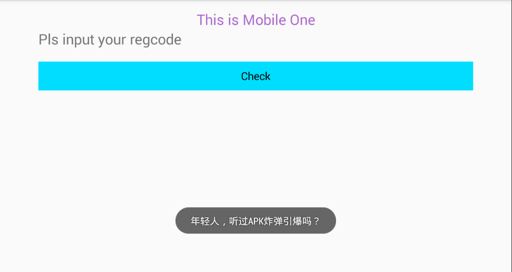

# Learn to Develop Android CM Step by Step-E3D09A8F45359DBC8C4D97D7088554F7

**Author：wnagzihxain
Mail：tudouboom@163.com**

## 0x00 前言
给今年北航杯CTF出的一道Mobile题，考察的地方放在了保护技术上，同时顺带考察了一个比较有意思的知识点

- https://github.com/toToCW/AndroidCrackMes/blob/master/4.E3D09A8F45359DBC8C4D97D7088554F7

## 0x01 Description
首先我添加了几个反调试
- TracerPid检测
- 23946端口检测
- inotify机制监控文件打开操作

其实原本是有`wchan检测`的，但是四哥曾经和我说这个反调试不靠谱，所以我去掉了

前两个反调试我放在了一个函数里，第三个反调试单独放进了一个函数

为了加强点难度，我把三个反调试函数放到了`.init_array`段和`JNI_OnLoad()`

接下来我们来撸代码，直接先KILL自己，同时写进了`.init_array`段，赛后听说有哥们换了好几个模拟器，要的就是这种效果。。。。。。
```
void __attribute__((constructor)) __init_array(void) {
    //LOGE("Call _init_array");
    pid_t pid = getpid();
    kill(pid, SIGKILL);
}
```

然后是把`inotify机制监控文件打开操作`反调试写进`.init_array`段
```
void __attribute__((constructor)) _init(void) {
    //LOGE("Call _init");
    j_j___gnu_Unwind_Save_VFP_D_16_to_31();
}
```

这个反调试需要新建子线程来运行，同时我写进了一个自定义的`.r0data`段
```
__attribute__((section(".r0data"))) __attribute__ ((visibility("default"))) void j_j___gnu_Unwind_Save_VFP_D_16_to_31() {
    //LOGI("Call anti debug...");
    if (pthread_create(&id_notify, NULL, (void *(*)(void *)) &j_j___gnu_Unwind_Save_VTP_D_16_to_31, NULL) != 0) {
        //LOGE("Failed to create a debug checking thread!");
        exit(-1);
    };
    pthread_detach(id_notify);
}
```

再调用，这里之所以要写一个跳转是因为我们的反调试通常会有多个，那么新开子线程调用后，需要在入口函数调用多种反调试函数，如下我们只实现了一种，所以只有一个函数，看起来就像是某种间接跳转
```
__attribute__((section(".r0data"))) __attribute__ ((visibility("default"))) void j_j___gnu_Unwind_Save_VTP_D_16_to_31() {
    j_j___gnu_Unwind_Save_VTP_D_16_to_32();
}
```

关于`inotify机制`可以参考我以前写过的反调试文章，有详细的原理解析与实践分析
```
__attribute__((section(".r0data"))) __attribute__ ((visibility("default"))) void j_j___gnu_Unwind_Save_VTP_D_16_to_32() {
    Security_Check_Stack();

    keep_running = 1;
    pid_t ppid = syscall(__NR_getpid);

    int fd;
    char buf[1024];
    fd = inotify_init();//初始化
    if (fd == -1) { //错误处理
        //LOGE("inotify_init error");
        return;
    }

    int wd;
    sprintf(buf, "/proc/%d/maps", ppid);
    wd = inotify_add_watch(fd, buf, IN_ALL_EVENTS); //添加监视

    if (wd == -1) { //错误处理
        //LOGE("inotify_add_watch");
        return;
    }

    while (keep_running) {
        if (j_j___gnu_Unwind_Save_VTP_D_15_to_31(fd) > 0) {
            j_j___gnu_Unwind_Save_VTE_D_16_to_31(fd);
        }
    }
    return;
}
```

其中两个函数
```
__attribute__((section(".r0data"))) __attribute__ ((visibility("default"))) int j_j___gnu_Unwind_Save_VTP_D_15_to_31(int fd) {
    fd_set rfds;
    FD_ZERO(&rfds);
    FD_SET(fd, &rfds);
    return select(FD_SETSIZE, &rfds, NULL, NULL, NULL);
}
```

第二个函数
```
__attribute__((section(".r0data"))) __attribute__ ((visibility("default"))) int j_j___gnu_Unwind_Save_VTE_D_16_to_31(int fd) {
    char buffer[16384] = {0};
    size_t index = 0;
    struct inotify_event *ptr_event;
    ssize_t r = read(fd, buffer, 16384);
    if (r <= 0) {
        //LOGE("read_event");
        return r;
    }

    while (index < r) {
        ptr_event = (struct inotify_event *) &buffer[index];
        //此处监控事件的读和打开，如果出现则直接结束进程
        if ((ptr_event->mask & IN_ACCESS) || (ptr_event->mask & IN_OPEN)) {
            //事件出现则杀死父进程
            //LOGI("hhhahahahahahahahahaahah");
            int ret = kill(getpid(), SIGKILL);
            return 0;
        }
        index += sizeof(struct inotify_event) + ptr_event->len;
    }
    return 0;
}
```

我还虚幻了一枪
```
__attribute__((section(".r0data"))) __attribute__ ((visibility("default"))) void Security_Check_Stack() {

}
```

那么`.init_array`段的函数实现这么多，接下来该是`JNI_OnLoad()`函数的实现了
```
jint JNICALL JNI_OnLoad(JavaVM *vm, void *reserved) {
    JNIEnv *env = NULL;
    jint result = -1;

    if (vm->GetEnv((void **) &env, JNI_VERSION_1_6) != JNI_OK) {
        //LOGE("vm->GetEnv error");
        return result;
    }

    j_j___gnu_Unwind_Save_VEP();

    if (registerNativeMethods(env, gClassName, gMethods, sizeof(gMethods) / sizeof(gMethods[0])) == JNI_FALSE) {
        return -1;
    }

    return JNI_VERSION_1_6;
}
```

同样在里面实现了一个反调试
```
__attribute__((section(".r0data"))) __attribute__ ((visibility("default"))) void  j_j___gnu_Unwind_Save_VEP() {
    //LOGI("Call anti_debug...");
    if (pthread_create(&id_anti_debug, NULL, (void *(*)(void *)) &j_j_inotify_add_see, NULL) != 0) {
        //LOGE("Failed to create a debug checking thread!");
        exit(-1);
    };
    pthread_detach(id_anti_debug);
}
```

比较常规的`TracerPid检测`以及`23946端口检测`，看起来像是间接跳转原因和前面一样
```
__attribute__((section(".r0data"))) __attribute__ ((visibility("default"))) void j_j_inotify_add_see() {
    //LOGI("Call readStatus...");
    __imp_pthread_destr0y();
}
```

`TracerPid检测`主体
```
__attribute__((section(".r0data"))) __attribute__ ((visibility("default"))) void __imp_pthread_destr0y() {
    FILE *fd;
    char filename[128];
    char line[128];
    pid_t pid = syscall(__NR_getpid);
    //LOGI("PID : %d", pid);
    sprintf(filename, "/proc/%d/status", pid);//读取/proc/pid/status中的TracerPid
    if (fork() == 0) {
        int pt = ptrace(PTRACE_TRACEME, 0, 0, 0); //子进程反调试
        if (pt == -1) {
            kill(pid, SIGKILL);
            exit(0);
        }
        while (1) {
            __imp_pthread_d3stroy(pid);
            fd = fopen(filename, "r");
            while (fgets(line, 128, fd)) {
                if (strncmp(line, "TracerPid", 9) == 0) {
                    int status = atoi(&line[10]);
                    //LOGI("########## status = %d, %s", status, line);
                    fclose(fd);
                    syscall(__NR_close, fd);
                    if (status != 0) {
                        //LOGI("########## FBI WARNING ##########");
                        //LOGI("######### FIND DEBUGGER #########");
                        kill(pid, SIGKILL);
                        return;
                    }
                    break;
                }
            }
            sleep(CHECK_TIME);
        }
    } else {
        //LOGE("fork error");
    }
}
```

`23946端口检测`的具体实现
```
__attribute__((section(".r0data"))) __attribute__ ((visibility("default"))) void __imp_pthread_d3stroy(pid_t pid) {
    char szLines[1024] = {0};
    FILE *fp = fopen("/proc/net/tcp", "r");
    if(fp != NULL) {
        while (fgets(szLines, sizeof(szLines), fp)) {
            if (strstr(szLines, "00000000:5D8A")) {
                //LOGI("########## FBI WARNING ##########");
                //LOGI("######### FIND DEBUGGER #########");
                kill(pid, SIGKILL);
                break;
            }
        }
        fclose(fp);
    }
    //LOGI("There is no android_server");
}
```

在`JNI_OnLoad()`函数中动态注册了两个函数，其实这里是我的锅，我本来想使用某种加密算法搞一下变形在JNI层进行校验的

后来时间稍微有点紧，于是我就转为保护技术的考察了，有些地方没处理干净，有同学说一直在分析`CheckRegCode()`，我的锅，我的锅，你们可以来打我。。。。。。
```
static JNINativeMethod gMethods[] = {
        {"CheckRegCode", "()Ljava/lang/String;", (void *) j_j___gnu_Unwind_Restore_WMMYD},
        {"releaseDexFile", "(Landroid/content/res/AssetManager;)V", (void *) j_j___gnu_Unwind_Restore_WMMYE}
};
```

我真的是忘了注释掉第一个注册函数了。。。。。。

而且第一个函数我还没写完。。。。。。

那么就来看第二个函数，第二个函数的实现大概是这样的：首先点击按钮，会触发这个函数，这个函数会去解密一个文件，然后删除解密后的文件，对，就是这么骚。。。。。。

然后Java层会动态加载解密后的Dex文件，存在就加载，不存在就弹出`"Sorry, y0u ar3 wrong"`

那么我们需要先把删除文件的指令Nop掉，然后重打包运行，拿到解密后的Dex文件，再去加载，会弹出一个Hint



当然此处会有同学用动态调试的方法，断点在此处，然后去拿Dex文件，那么反调试就派上用场了。。。。。。

同理Nop掉反调试可以进行动态调试拿Dex文件

那么这个`APK炸弹引爆`是一个很有意思的知识，源自阿里聚安全当年的一篇文章
- Apk协作攻击漏洞“炸弹引爆”详解：http://jaq.alibaba.com/blog.htm?id=76

同时为了防止没人做出来，我也给了主办方一个Hint，也不知道他们放了没有
- APK里有一个炸弹

我利用了这篇文章中的一个知识点：把一个加密后的Dex文件放到了`.RSA`签名文件后面

还需要知道一个小知识点，`.RSA`文件大概只有1k大小，那么直接使用二进制编辑器，拉到1k左右的地方，就可以看到


那么把这个加密后的Dex文件抠出来，其实在这个地方，我们注意数据的分布，很大片的`0x88`，这意味着什么呢？？？

这个抠出来放一边，观察到抠出来的数据长度为940字节

关于解密，第一次弹出Hint的时候，我使用的方式是简单的异或，其实一直用的是异或，我怕用了其余的文件加解密算法会太难了
```
/*
 * Class:     com_wnagzihxain_myapplication_MainActivity
 * Method:    releaseDexFile
 * Signature: (Landroid/content/res/AssetManager;)V
 */
__attribute__((section(".gnu.versi0n"))) void JNICALL j_j___gnu_Unwind_Restore_WMMYE
        (JNIEnv *env, jclass clazz, jobject assetManager) {
    uint8_t  XOR_KEY = 0x66;
    AAssetManager* aAssetManager = AAssetManager_fromJava(env, assetManager);
    if(aAssetManager==NULL) {
        return ;
    }

    const char* filename = (char*)"boooooooooom";
    AAsset* encryptDexFile = AAssetManager_open(aAssetManager, filename, AASSET_MODE_UNKNOWN);
    if (encryptDexFile == NULL) {
        //LOGI("aAsset is NULL");
        return;
    }

    off_t bufferSize = AAsset_getLength(encryptDexFile);

    char* lpencryptDexFile = (char*) malloc(bufferSize);
    int nreadBytes = AAsset_read(encryptDexFile, lpencryptDexFile, bufferSize);
    if (nreadBytes != bufferSize) {
        return;
    }

    char* lpdecryptDexFile = (char*) malloc(bufferSize);
    if (bufferSize == 940) {
        XOR_KEY = 0x88;
    }
    for (int i = 0; i < bufferSize; ++i) {
        *(lpdecryptDexFile + i) = (uint8_t)(*(lpencryptDexFile + i) ^ XOR_KEY);
    }
    mkdir("/sdcard/com.wnagzihxain.myapplication/", 0775);

    int fd = open("/sdcard/com.wnagzihxain.myapplication/myDex.dex", O_CREAT | O_RDWR | O_TRUNC, S_IRWXO);
    lseek(fd, 0, SEEK_SET);
    write(fd, lpdecryptDexFile, bufferSize);
    close(fd);
    free(lpencryptDexFile);
    free(lpdecryptDexFile);
    lpencryptDexFile = NULL;
    lpdecryptDexFile = NULL;
    remove("/sdcard/com.wnagzihxain.myapplication/myDex.dex");
    AAsset_close(encryptDexFile);
}
```

那么中间我做了数据长度的判断，这里也是一个小Hint，如果注意到这点同时注意到签名文件抠出来的数据长度，就可以联想起来

如果长度是940字节，那么将异或的KEY改为`0x88`

所以想要解密出最终的Dex文化，有两种办法，一种是直接把这个Dex文件重命名，放到assets文件夹，重打包运行，就可以弹出Flag

第二种是写代码异或，数据和KEY都已经知道，再分析异或后的Dex文件即可得出最终的Flag


## 0x02 小结
没人做出来这肯定是我的锅，我以后会认真出题的


