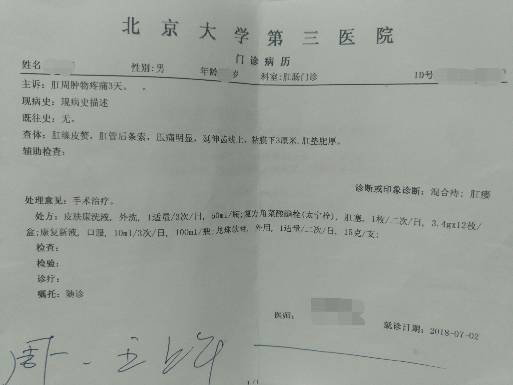
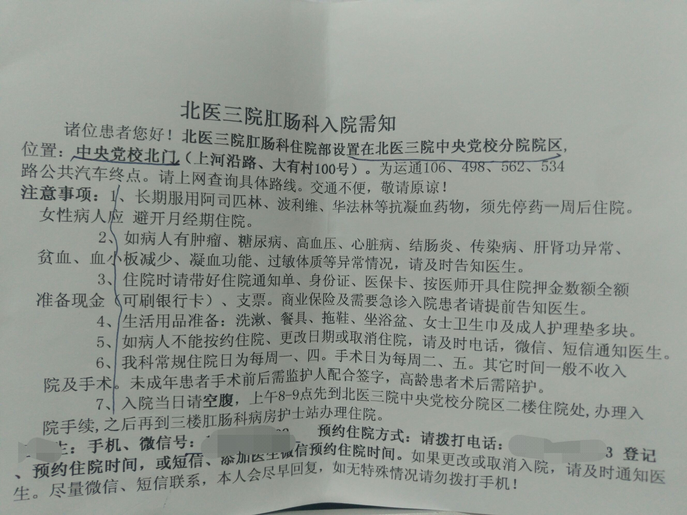

# 肛肠疾病患者术后回忆录

**Author:wnagzihxa1n
E-Mail:wnagzihxa1n@gmail.com**

**高能预警：本文自带浓浓令人不适的味道，对屎尿屁过敏的请绕道**

**声明：文中提到的医院等，你们可能会有更好的选择，不要问我为什么不去xxx医院，为什么不去挂yyy医生的专家号，我一个外地来北京搬砖的，去不起北京什么什么最好的医院，也没有钱去黄牛那买百千块钱的专家号，对我来说，先检查下肛门是啥问题最重要**

## 0x00 前言

我先给自己点安慰：搞IT的，屁股得点病，很正常

今天是术后出院第一天，下床走路啥的已经没问题了，但是也不能站太久，站十来分钟就得侧躺着，有不少朋友和我一样，外地户口，在北京的互联网公司搬砖，有北京的社保，本着自由分享的精神，给大伙分享下肛肠疾病手术相关

## 0x01 挂号看病

一开始是有点内痔，不出血，但是坐久了会疼，从去年开始，去医院看过几次，每次都是和我说没啥事，涂点药膏就行，后来自己也意识到不能总是坐久了就疼，想着去做个手术，但是只是想，还没有落实下来

结果大概是上个月二十号左右，擦屁股突然有血，但是大便里没有血，纸巾上的血量大概是一滴血的样子

这种情况持续了几天，期间一直是出血，不疼，但是一直是出血，于是盘算着周末去医院看看，结果在周末前的一天早上，我突然发现肛门上方长了个痘痘，我以为只是个痘痘，并没有太在意，又过了一天，我发现它变肿了，就像脸上长的痘痘，里面有脓的那种感觉，每次擦屁股都是疼得不行

所以赶紧的挂号约医生，因为时间比较着急，正常的医院，有号的就直接挂了

北京市有一个统一挂号平台
- http://www.bjguahao.gov.cn/index.htm

但是这个挂号有个提前几天的限制，就是得提前几天预约，当时已经看不到周一的号了，所以我和李神探想了想，先去北京大学第三医院直接挂号看看，如果没有号，打个车去武警总医院

北大三院是三甲，我用的是北京市的社保卡，先在自助机办了张就医卡，北大三院的卡，具体我也不是很清楚，因为有很多选项，在挂号的时候，折腾了一会，最后办了一张就医卡，再用就医卡进行挂号，主治医师，五十块钱挂号费，有医保就只要十块钱，挂了号之后需要到13，14，15这三个窗口去办理社保卡和就医卡的关联，关联完后，去二楼的候诊室签到，然后等着就行

因为怕没号，所以我们去的比较早，去候诊室的时候，护士还没有开始签到，所以我们就一直在候诊室等到了八点才开始签到

签完到后在门口紧张的等着，因为一会肯定要做指检，但凡肛门有点啥问题，指检一般跑不掉，没做过指检的朋友，指检就是医生带上医用塑胶手套，抹点润滑油之类的液体，然后滋溜一下捅到肛门里，用的是食指还是中指我就不清楚了，疼不疼就看你肛门是啥问题了，反正我是疼的不行

指检有很多体位，有的是跪床上，把屁股翘高，有的是侧躺着，双手抱膝，具体的看医生的指示，我是跪床上，医生做完指检后，说我是一个混合痔加上肛瘘以及粘膜下瘘，当时听着还是挺紧张的，一直以为只是简单地痔疮，医生直接就说这个要手术才能治好，药物没啥效果，要手术的话需要周四办理住院，周五开始手术，周六观察一天，周日出院

医生说手术后需要休息至少两个星期，当时考虑到医保和需要人照顾的问题，综合考虑之下，选择了在北京手术，医保的问题后面再讲

这是诊断单

因为看病那天是周一，而周一已经来不及办理入院了，只能办理周四的，所以医生开了点药，防止变严重

一共是四种药，一个是抹的，一个是塞的，一个是喝的，一个是泡的

如上图所说的，皮肤康是用来泡屁股的，成分为中药，很浓

至于抹的和塞的，抹的叫龙珠软膏，塞的是一种形状类似麝香痔疮栓一样的玩意，不过是白色的，说是要把龙珠软膏抹到子弹头上面，然后塞到肛门里，最后一个喝的，有点恶心，成分中写的是`美洲大蠊干燥虫体提取物`，略微有点腥

住院通知单，北大三医的肛肠科住院部不在三医总部，在中央党校那，不是很大

到楼下拿了药，回家按医生说的，坚持坐浴，泡屁股还是很舒服的

## 0x02 办理住院

## 0x03 手术

## 0x04 术后恢复

## 0x05 出院

## 

